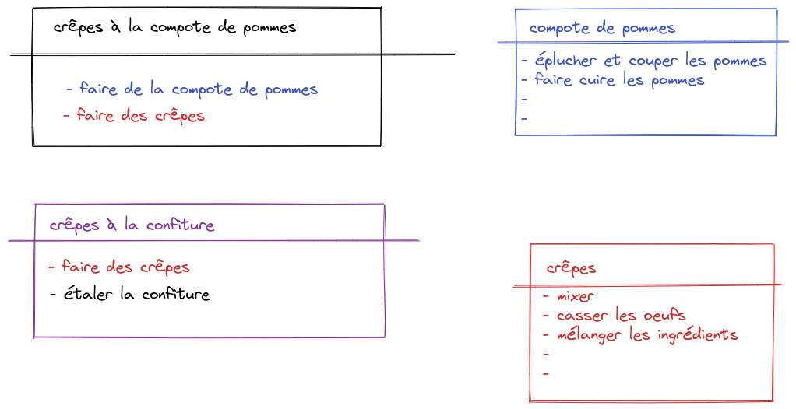
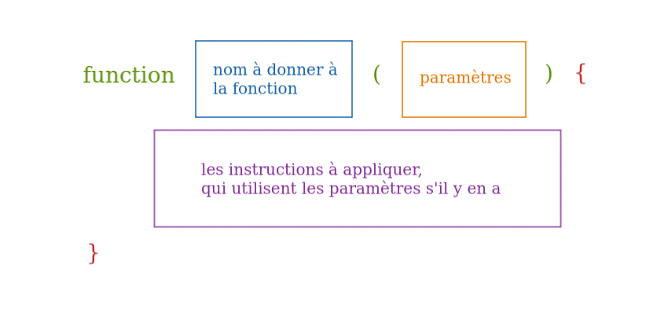
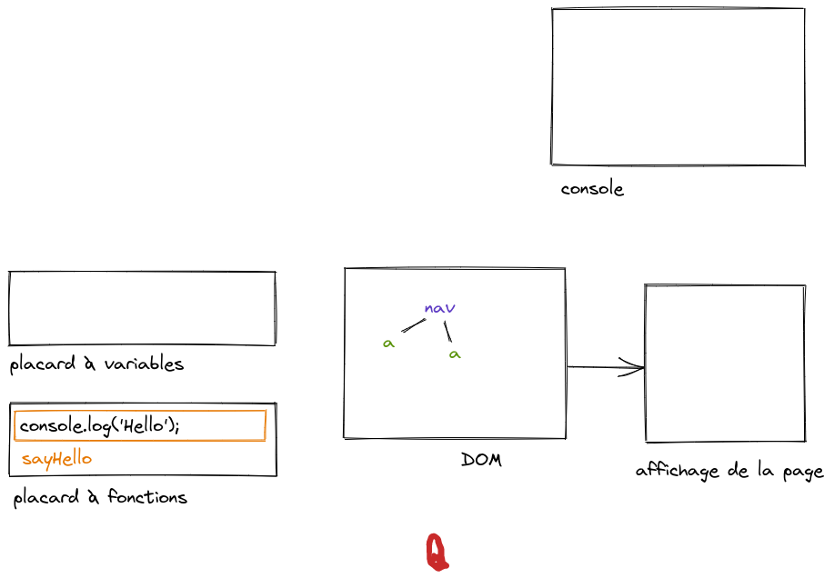
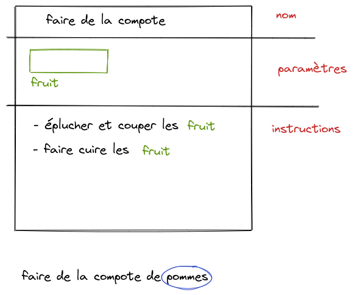

# Fonction

# C'est quoi ? Ca sert à quoi ?

Une fonction c'est un traitement (un ensemble d'instructions) qu'on range à part pour pouvoir s'en servir quand on en a besoin.

C'est comme une recette de cuisine : un nom (important pour repérer la recette), et des instructions (qu'il faudra appliquer dans le bon ordre).

Exemples d'utilisation :
- avoir un traitement réutilisable
- découper un gros traitement en plusieurs traitements plus petits

## Exemple avec une recette

Si on a une "recette de crêpes à la compote de pommes", on pourrait écrire toutes les instructions à la suite, celles pour la compote et celles pour les crêpes, mais avec beaucoup d'instructions ça va rendre la recette compliquée.

Ce sera plus simple si on découpe notre recette avec deux sous-recettes (deux autres fonctions :wink:), une pour la compote et une pour les crêpes.

Et en plus, on pourra réutiliser ces autres recettes indépendamment (juste faire de la compote, par exemple) ou les combiner avec d'autres recettes (faire des crêpes à la confiture par exemple).



# Syntaxe en JS

## Définition (ou déclaration) de la fonction



Pour le nom d'une fonction :
- les espaces sont interdits (camelCase ou _)
- par convention on commence par une minuscule
- souvent on préfère commencer par un verbe : addComment, computeResult.

Quand on déclare une fonction, en fait JS va juste aller ranger la fonction dans son "placard à fonctions", il ne va pas appliquer les instructions.



## Appel (ou exécution) de la fonction

Pour appeler la fonction (appliquer les instructions) :
- `nomDeLaFonction();` pour une fonction sans paramètres
- avec paramètres => voir plus bas le deuxième exemple

JS va chercher la fonction dans son "placard à fonctions" et il applique la liste d'instructions qui correspond, en utilisant les valeurs pour les paramètres s'il y en a.

On peut facilement ré-appliquer plusieurs fois le traitement d'une fonction, c'est l'un des intérêts d'une fonction d'ailleurs.

# Premier exemple : fonction sans paramètre

```js
// une fonction qui affiche bonjour dans la console
// le nom de cette fonction est "sayHello"
function sayHello() {
  // ici les instructions
  console.log('Hello');

  // on aurait pu aussi aller créer un élément sur la page et mettre le texte hello dedans
}

// là on a juste déclaré une fonction, on a défini un traitement, mais on n'a pas demandé à l'appliquer

// Pour appliquer le traitement, on appelle la fonction, on exécute la fonction
// sayHello();
```

Plus tard, on verra comment déclencher une fonction quand on clique sur un bouton de la page :muscle: . En attendant, pour s'entraîner, on exécutera nos fonctions directement dans la console.


## Deuxième exemple

Si on veut dire bonjour, mais en précisant le prénom de la personne ?

Les paramètres, c'est pour personnaliser le traitement, pour avoir un traitement un peu plus générique.

C'est comme des cases qui portent un nom, et dans les instructions on fait référence au nom du paramètre pour utiliser sa valeur.



Nom de paramètre : mêmes contraintes que les noms de variable

```js
// on définit une fonction pour dire bonjour à quelqu'un, en citant son prénom
// firstName est appelé "paramètre" de la fonction
function sayHi(firstName) {
  // ici les instructions
  console.log('Hello ' + firstName);
}

// on dit à JS qu'on veut appliquer le traitement en utilisant "Nicolas" comme valeur pour le paramètre firstName
sayHi("Nicolas");

sayHi("Déborah");

// ici on a oublié de donner une valeur pour le paramètre (ce n'est pas ce qu'on veut faire, c'est juste pour la démo)
// sayHi();
// => ca affiche "Hello undefined", parce que la valeur du paramètre firstName n'a pas été définie
```

## Exemple de fonction avec plusieurs paramètres

```js
// on définit une fonction pour dire bonjour à quelqu'un, en citant son prénom
function sayHi(firstName, lastName) {
  // ici les instructions
  console.log('Hello ' + firstName + ' ' + lastName);
}

// on dit à JS qu'on veut appliquer le traitement en utilisant "Nicolas" comme valeur pour le paramètre firstName
sayHi("Nicolas", "Dupont");

sayHi("Harry", "Potter");

// ici on a oublié de donner des valeurs pour les paramètres (ce n'est pas ce qu'on veut faire, c'est juste pour la démo)
// sayHi();
// => ca affiche "Hello undefined", parce que la valeur du paramètre firstName n'a pas été définie
```

(TODO) inversion de paramètres
sayHi("Harry", "Potter");

(TODO image)

